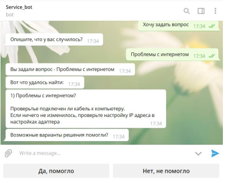
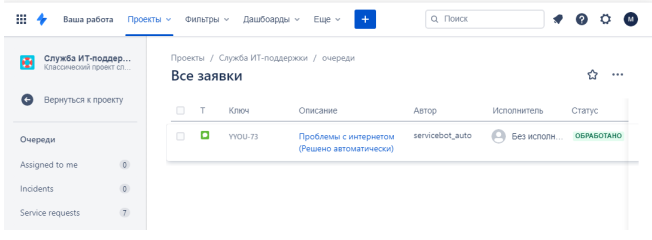
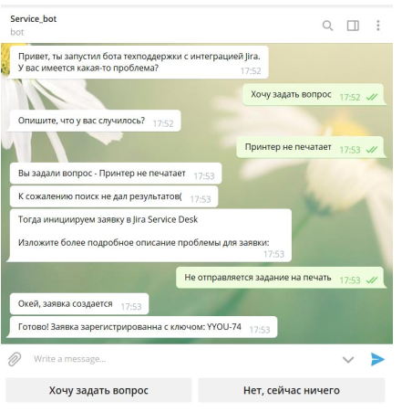
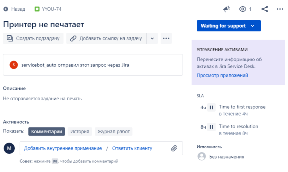

# Сценарии использования
## 1. Успешный поиск по БД
### ЧатБот производит поиск по базе данных готовых решений, при совпадении выводит варианты:

### Если пользователь отвечает утвердительно - создается сразу закрытая заяка:

## 2. Если решений нет или они не подошли
### ЧатБот уточняет детали заявки которые в дальнейшем станут описанием заявки

### Так создается обычная заявка:

Поиск написан всратый, но рабочий

Использована официальная библиотека Jira для работы с api

*Было представлено в качестве бакалаврской дипломной работы
